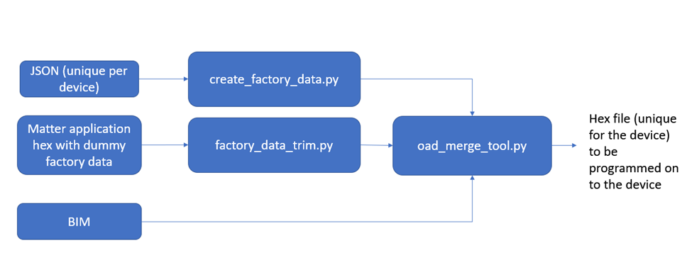
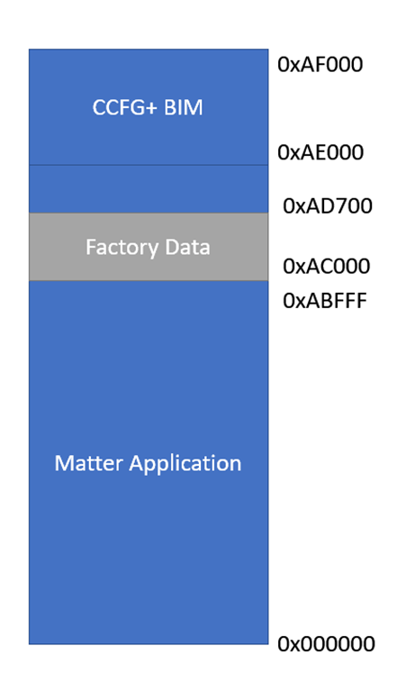
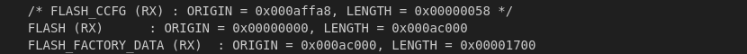
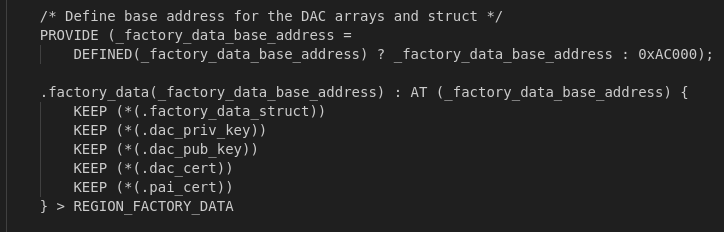
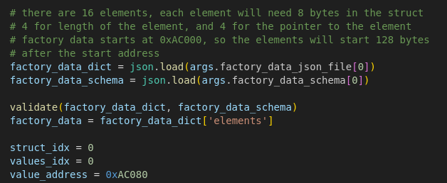

Texas Instruments Inc. Matter: Factory Data Programming User Guide

Introduction:

This document describes how to use Factory data programming feature for the
Matter example applications from Texas Instruments.

## Background

Matter specification lists various information elements that are programmed at
factory. These values do not change and some are unique per device. This feature
enables customers developing matter products on TI devices to program this data
and use this as a starting point towards developing their factory programming
infrastructure for their Matter devices.

## Solution Overview:

TI matter examples allow to use the factory data in the following two ways:

-   **Example Out of Box Factory Data** : Use TI example DAC values to get
    started. This is intended to be used when just starting with matter or
    during the development until customer or product specific data is not
    required.
-   **Custom factory data** : Allows to configure custom factory data via a JSON
    file. The custom values are then processed by a script provided by TI and
    merged with the matter application to create a binary that can be flashed on
    to the devices.

### Solution Block Diagram

Below is the high level description of each element

1. JSON: This file is located at src/platform/cc13xx_26xx/cc13x2_26x2. Developer
   would configure this per device. Elements in this file are from the
   specification.
2. Matter application hex with dummy factory data is any TI's matter example
   application
3. BIM is the Boot image manager that allows to write and read/program the OTA
   image received over the air for upgrade. This is built with the matter
   application. This does not require additional build steps from developers.
4. Create_factory_data.py: processes JSON file and generates hex file with
   unique factory data values configured in the JSON file.
5. Factory_data_trim.py: when using the custom factory data option, this script
   removes the dummy factory data which is required to be able to successfully
   compile the application.
6. ad_merge_tool.py: Merges the factory data hex, matter application without
   factory data and bim to generate a functional hex that can be programmed on
   to the device.

## Flash memory layout

Key Points:

Out of box factory data location is configured to be on second last page on the
flash. The address starts at 0xAC000. This can be configured in the linker
command file.

To configure:

1. Linker command file: Set the start address for factory data
   
   

2. create_factory_data.py: Set the address of the start of the factory data
   elements. Refer to the comments in the script.
   

It is recommended to keep a dedicated page for factory data.
